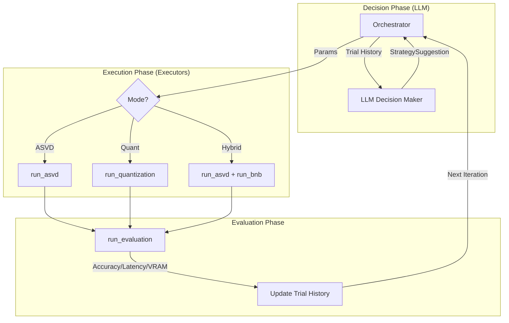

# Global Tuner: Modular AI Agent for LLM Compression

This directory contains the **Global Tuner**, an autonomous agent designed to optimize LLM compression through a combination of **ASVD (Activation-aware SVD)** and **Quantization (GPTQ/AWQ/BNB)**.

##  Agent Architecture (`modular_agent/`)

The agent follows a modular "Plan-Execute-Evaluate" loop:




### 1. Orchestrator (`orchestrator.py`)
- **The Brain**: Manages the main optimization loop.
- Coordinates between the LLM decision-maker and the execution modules.
- Handles memory cleanup and trial history tracking.

### 2. LLM Decision Maker (`llm_client.py`)
- **The Strategist**: Uses GPT-4o (or configured model) to analyze trial history.
- Decides the next best compression strategy based on performance metrics (Accuracy vs. VRAM vs. Latency).
- Enforces critical constraints (e.g., Hybrid mode must use BNB).

### 3. Executors (`executors.py`)
- **The Hands**: Wrapper functions that invoke the actual compression tools.
  - `run_asvd`: Invokes the ASVD build process from `ASVD4LLM-main`.
  - `run_quantization`: Invokes unified quantization methods from `tmp/method/`.
  - `run_evaluation`: Runs benchmarks (e.g., GSM8K) to get performance metrics.

### 4. Schemas (`schemas.py`)
- **The Protocol**: Defines the structured data format (Pydantic models) for communication between the LLM and the system.
- Ensures the LLM provides all necessary parameters like `alpha`, `param_ratio_target`, `quant_bits`, and `quant_group_size`.


## 🛠️ Compression Methods
- **ASVD**: Structural pruning/rank reduction. Best for inference speed.
- **Quantization**: 
  - **GPTQ/AWQ**: High-performance standalone quantization.
  - **BitsAndBytes (BNB)**: Compatible with ASVD for hybrid compression.

## 🚀 How to Run
```bash
# From the project root
python3 -m Global_Tuner.modular_agent.orchestrator
```
*Note: Ensure your `.env` file contains the required `LLM_API_KEY`.*
