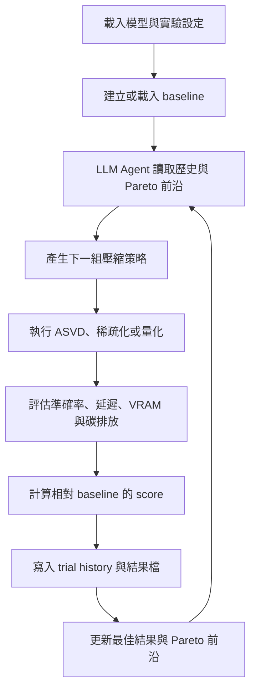

# Green AI：以 LLM Agent 自動搜尋大型語言模型壓縮策略

本專案是一套用於研究大型語言模型壓縮的實驗平台。系統不只執行單一量化或剪枝方法，而是讓 LLM Agent 根據每一輪實驗結果，自動選擇下一組壓縮策略，並以模型準確率、推論延遲、GPU 記憶體使用量與碳排放量作為評估依據。

本專案目前最主要的研究版本是 `Global_Tuner_memory`。此版本在 Global Tuner 的自動化壓縮流程上加入 Agentic Memory，研究不同歷史資訊管理方式如何影響壓縮策略搜尋效率、評估分數與 LLM token 使用量。

## 目錄

- [一、研究目標](#一研究目標)
- [二、系統核心流程](#二系統核心流程)
- [三、Global Tuner Memory](#三global-tuner-memory)
	- [3.1 `full`：完整歷史記憶](#31-full完整歷史記憶)
	- [3.2 `window`：滑動視窗記憶](#32-window滑動視窗記憶)
	- [3.3 `summary`：演化式知識摘要](#33-summary演化式知識摘要)
	- [3.4 `tool`：工具檢索記憶](#34-tool工具檢索記憶)
- [四、可用壓縮策略](#四可用壓縮策略)
- [五、評估與分數計算](#五評估與分數計算)
- [六、安裝與環境需求](#六安裝與環境需求)
- [七、執行 Global Tuner Memory](#七執行-global-tuner-memory)
	- [7.1 單次執行](#71-單次執行)
	- [7.2 記憶模式 benchmark](#72-記憶模式-benchmark)
	- [7.3 接續中斷的 benchmark](#73-接續中斷的-benchmark)
- [八、實驗輸出](#八實驗輸出)
- [九、模組職責](#九模組職責)
- [十、其他版本的定位](#十其他版本的定位)
	- [`Global_Tuner_functions` Dashboard](#global_tuner_functions-dashboard)
- [十一、注意事項](#十一注意事項)
- [十二、專案目錄概覽](#十二專案目錄概覽)
- [十三、Contributors 與第三方專案致謝](#十三contributors-與第三方專案致謝)
	- [Third-party projects](#third-party-projects)

## 一、研究目標

大型語言模型通常具有較高的參數量與硬體需求。模型壓縮可以降低模型大小、GPU 記憶體需求與推論成本，但不同壓縮方法之間存在明顯取捨：

- 壓縮比例提高，可能造成準確率下降。
- 量化可能降低記憶體使用量，但不一定降低實際延遲。
- 稀疏化需要搭配支援的硬體與模型格式，才可能獲得推論加速。
- 低秩分解可能減少參數量，但壓縮後模型仍需經過完整評估。
- 多輪實驗會產生大量歷史資料，若將全部資料交給 LLM，會增加 token 成本並使決策品質受到上下文長度影響。

本專案的核心問題是：如何讓 LLM Agent 在有限的上下文與計算資源下，找到兼顧準確率、速度、記憶體與能源消耗的模型壓縮配置。

## 二、系統核心流程

Global Tuner Memory 採用「決策、壓縮、評估、更新記憶」的循環流程：



每一輪 trial 的主要步驟如下：

1. 讀取目前的實驗歷史與 Pareto frontier。
2. 由 LLM Decision Maker 選擇尚未嘗試或值得深入探索的壓縮模式。
3. 使用 Pydantic schema 驗證 LLM 回傳的策略參數。
4. 執行對應的模型壓縮流程。
5. 載入壓縮後模型，執行指定資料集的評估。
6. 將準確率、延遲、VRAM、碳排放與綜合分數寫入結果。
7. 更新歷史紀錄、最佳 trial 與 Pareto frontier。
8. 視設定刪除非最佳 trial，以降低磁碟空間與 GPU 記憶體壓力。

## 三、Global Tuner Memory

主要程式位於：

```text
Global_Tuner_memory/
└── modular_agent_new/
		├── orchestrator.py
		├── llm_client.py
		├── executors.py
		├── schemas.py
		└── utils.py
```

`modular_agent_new` 是目前較完整的實作版本，包含 token 使用量記錄、OOM 重試、實驗恢復與記憶模式 benchmark。`modular_agent` 是較早期的相關實作，保留作為參考。

### 3.1 `full`：完整歷史記憶

每次決策都將全部 trial history 放入 prompt。LLM 可以看到完整的實驗脈絡，適合實驗輪數較少或需要保留所有細節的情況。

優點是資訊完整；缺點是 prompt 會隨 trial 數增加，導致 token 成本上升、上下文變長，以及 LLM 可能難以辨識真正重要的資訊。

### 3.2 `window`：滑動視窗記憶

只將最近五次 trial 傳給 LLM。此方法維持較小的 prompt，讓 Agent 聚焦在近期結果與局部搜尋方向。

優點是 token 成本較低、決策速度較快；缺點是早期失敗經驗可能不再出現在上下文中，Agent 可能重新嘗試過去已知效果不佳的方向。

### 3.3 `summary`：演化式知識摘要

每累積五次 trial，使用 `SUMMARY_MODEL`，預設為 `gpt-4o-mini`，將近期實驗整理成知識摘要。主要 Agent 看到的是：

- 目前的知識摘要。
- 尚未被摘要的近期 trial。

摘要固定整理四類資訊：

- 參數與指標之間的關聯。
- 已知的安全參數區域。
- 曾造成失敗或嚴重懲罰的危險區域。
- 下一階段建議探索方向。

此模式保留長期經驗，又不必持續傳送所有原始 trial；代價是需要額外的摘要 API 呼叫，且摘要品質會影響後續決策。

### 3.4 `tool`：工具檢索記憶

主要 prompt 只包含最近三次 trial 與 Pareto frontier。當 Agent 需要了解特定方法的歷史時，可以呼叫 `retrieve_trials` 工具，依方法檢索分數最高的相關 trial。

可檢索的方向包括 `asvd`、`gptq`、`awq`、`qqq`、`bnb`、`sparse` 與 `hybrid`。每次 iteration 最多進行有限次工具查詢，避免工具呼叫無限增加。工具查詢也會記錄到 `tool_debug_log.jsonl`，方便分析 Agent 在做決策時查閱了哪些歷史資料。

此模式將「是否需要更多歷史」交由 Agent 主動決定，適合研究檢索式 Agent 與固定上下文策略之間的差異。

## 四、可用壓縮策略

LLM 透過 `StrategySuggestion` 產生結構化策略。實際支援的模式如下。

| 模式 | 主要方法 | 說明 |
|---|---|---|
| `asvd_only` | ASVD | 使用 Activation-aware SVD 進行低秩分解，降低參數量與推論成本。 |
| `gptq` | GPTQ | Hessian-aware 權重量化，可選 3、4 或 8 bit。 |
| `awq` | AWQ | Activation-aware 量化，固定 4 bit，支援多種 group size。 |
| `qqq` | QQQ | 以 QQQ 格式進行 4 bit 量化，支援特定 group size。 |
| `bnb` | BitsAndBytes | 使用 4 或 8 bit 的執行時量化，適合不需要另存完整量化權重的情境。 |
| `sparse_unstructured` | SparseGPT | 非結構化稀疏化，可指定約 30% 至 70% 的稀疏比例。 |
| `sparse_structured` | SparseGPT | 結構化稀疏化，支援 `2:4` 與 `4:8`。 |
| `hybrid_asvd_bnb` | ASVD + BNB | 先執行 ASVD，再以 BitsAndBytes 量化。 |

### ASVD 參數

- `alpha`：可使用 `0.3`、`0.4`、`0.5`、`0.6`、`0.7`。
- `param_ratio_target`：保留參數比例，範圍為 `0.70` 至 `0.99`。數值越低通常代表壓縮越強。
- `scaling_method`：`abs_mean`、`abs_max` 或 `fisher`。

### 量化參數

- GPTQ：`quant_bits` 可為 `3`、`4`、`8`；`quant_group_size` 可為 `16`、`32`、`64`、`128`、`256`。
- AWQ：固定 4 bit；group size 可為 `16`、`32`、`64`、`128`。
- QQQ：固定 4 bit；group size 可為 `-1` 或 `128`。
- BNB：可使用 4 或 8 bit；4 bit 可選擇 double quantization。

## 五、評估與分數計算

評估器位於 `Evals/`，可對單一或多個資料集進行評估。支援的資料集以 `Evals/config/dataset_config.yaml` 和 `Evals/__init__.py` 的註冊內容為準，常見任務包括 GSM8K、TruthfulQA、CommonsenseQA、HumanEval 與 BBH。

每個壓縮模型會量測：

- `accuracy`：任務正確率。
- `latency`：生成所需時間。
- `vram`：GPU 記憶體使用量，單位為 GB。
- `emissions`：估計的碳排放量，單位為 kg CO2。

系統先對原始模型建立 baseline。若指定多個 task，準確率、延遲與碳排放取平均，VRAM 取各 task 的最大值。

在有 baseline 時，分數使用對數型相對改善公式：

$$
score = 1 + w_{acc}\log\left(\frac{Acc}{Acc_{base}}\right)
			+ w_{lat}\log\left(\frac{Lat_{base}}{Lat}\right)
			+ w_{vram}\log\left(\frac{VRAM_{base}}{VRAM}\right)
			+ w_{emit}\log\left(\frac{Emit_{base}}{Emit}\right)
$$

其中準確率越高越好，而延遲、VRAM 與碳排放越低越好。因此，分數大於 1 代表相對 baseline 的整體指標較佳，但不代表每一項指標都改善。

另外，當準確率下降幅度超過 `pen_t`，系統會套用由 `pen_a` 控制的額外懲罰，以避免 Agent 只追求壓縮率而犧牲過多模型能力。

## 六、安裝與環境需求

本專案主要針對具有 CUDA GPU 的環境。建議先啟用專案使用的 Conda 環境，再依照下列順序安裝：

```powershell
conda activate GreenAI
pip install -r requirements/base.txt
pip install -r requirements/llm.txt
pip install -r requirements/evaluation.txt
```

依賴檔案依照功能分層，內容如下：

| 檔案 | 用途 | 主要內容 |
|---|---|---|
| `requirements/base.txt` | 基礎環境與 Dashboard | Python 通用套件、資料處理、Plotly、OpenAI client、Pydantic、Streamlit 等。 |
| `requirements/gpu.txt` | NVIDIA GPU 環境 | CUDA 12 套件、NVIDIA GPU 監控、bitsandbytes 與 GPU 相關元件。 |
| `requirements/llm.txt` | LLM 與模型壓縮 | Transformers、Accelerate、GPTQModel、LLM Compressor、TorchAO、Datasets 與 Safetensors。 |
| `requirements/evaluation.txt` | 評估工具 | HumanEval、lm-eval、ROUGE、BLEU、TokeNicer 與其他評估依賴。 |

若在相容的 NVIDIA GPU 環境執行，另外安裝 GPU 依賴：

```powershell
pip install -r requirements/gpu.txt
```

`requirements/gpu.txt` 只應在確認 CUDA 與 NVIDIA 驅動相容時安裝。若使用 CPU、沒有 NVIDIA GPU，或目前只需要閱讀程式碼，則不需要安裝此檔案。

PyTorch 建議依照實際 CUDA 版本單獨安裝。例如 CUDA 12.8 環境可以使用：

```powershell
pip install torch --index-url https://download.pytorch.org/whl/cu128
```

`requirements/llm.txt` 已經包含 `GPTQModel`；若需要編譯或使用 AWQ、QQQ 相關 CUDA kernel，請確認 PyTorch、CUDA 與 NVIDIA 驅動版本相容。若環境需要重新編譯 GPTQModel，也可使用：

```powershell
pip install -v GPTQModel --no-build-isolation --force-reinstall --no-cache-dir
```

在 Windows 環境中，`requirements/gpu.txt` 內部分 Linux 或伺服器專用套件已被註解，請勿在未確認支援狀況前自行啟用 `triton`、`bitblas`、`nvidia-nccl` 或 `nvidia-cufile`。

請在專案根目錄建立 `.env`：

```dotenv
LLM_API_KEY=你的 OpenAI API Key
LLM_MODEL=gpt-4o
SUMMARY_MODEL=gpt-4o-mini
HF_TOKEN=你的 Hugging Face Token
```

其中 `LLM_API_KEY` 是 LLM Agent 決策所需的必要設定；若模型或資料集需要權限，則需要設定 `HF_TOKEN`。

## 七、執行 Global Tuner Memory

### 7.1 單次執行

從專案根目錄執行：

```powershell
python -m Global_Tuner_memory.modular_agent_new.orchestrator `
	--model_id meta-llama/Llama-3.2-1B-Instruct `
	--task gsm8k `
	--max_iterations 10 `
	--num_samples 100 `
	--memory_type summary `
	--acc_weight 3.0 `
	--lat_weight 1.0 `
	--vram_weight 1.0 `
	--emit_weight 1.0
```

`--task` 可以使用逗號指定多個資料集，例如 `gsm8k,truthfulqa`。若省略 `--num_samples`，則使用資料集設定中的樣本數。

### 7.2 記憶模式 benchmark

設定 `--benchmark_runs` 大於 1 時，程式會依序測試 `window`、`summary`、`tool` 與 `full`，每種模式執行指定次數，並計算平均分數、最佳分數、標準差與成功次數：

```powershell
python -m Global_Tuner_memory.modular_agent_new.orchestrator `
	--model_id meta-llama/Llama-3.2-1B-Instruct `
	--task gsm8k `
	--max_iterations 10 `
	--num_samples 100 `
	--benchmark_runs 3
```

Benchmark 結果會即時寫入：

```text
tuning_results/benchmark_YYYYMMDD_HHMMSS/benchmark_report.md
```

### 7.3 接續中斷的 benchmark

`modular_agent_new` 支援使用 `--resume_benchmark` 接續既有 benchmark 目錄。程式會讀取 `benchmark_report.md`，跳過已完成的記憶模式，並從有 `optimization_results.json` 的實驗目錄恢復：

```powershell
python -m Global_Tuner_memory.modular_agent_new.orchestrator `
	--model_id meta-llama/Llama-3.2-1B-Instruct `
	--task gsm8k `
	--max_iterations 10 `
	--benchmark_runs 3 `
	--resume_benchmark tuning_results/benchmark_20260323_165306
```

## 八、實驗輸出

每次實驗會建立類似下列的目錄：

```text
tuning_results/
├── baselines/
│   ├── Llama-3.2-1B-Instruct_gsm8k.json
│   └── Llama-3.2-1B-Instruct/
│       └── gsm8k_results.json
└── exp_Llama-3.2-1B-Instruct_gsm8k_summary_YYYYMMDD_HHMMSS/
		├── experiment_config.json
		├── optimization_results.json
		├── pareto_frontier.json
		├── llm_usage_log.jsonl
		├── tool_debug_log.jsonl
		└── trial_001_.../
				├── config.json
				├── *.safetensors
				└── gsm8k_results.json
```

重要檔案說明：

- `experiment_config.json`：模型、資料集、迭代輪數、分數權重與 baseline。
- `optimization_results.json`：每個 trial 的策略、LLM 建議、評估指標、分數與模型路徑。
- `pareto_frontier.json`：在準確率、延遲、VRAM 與碳排放之間沒有被其他 trial 完全支配的結果。
- `llm_usage_log.jsonl`：每次 LLM API 呼叫的輸入、輸出與總 token 數，包含摘要、工具呼叫與 JSON 驗證重試。
- `tool_debug_log.jsonl`：`tool` 記憶模式查詢歷史 trial 的紀錄。
- `baselines/`：原始模型的評估快取。當模型、資料集與樣本數相同時，後續實驗會重用 baseline。

預設情況下，程式會在每輪完成後清理非最佳 trial，最後保留最佳模型。若要保留所有 trial，請加入 `--no-cleanup`；若連最佳模型也不保留，請加入 `--no-keep-best`。

## 九、模組職責

| 模組 | 職責 |
|---|---|
| `orchestrator.py` | 管理 baseline、迭代流程、壓縮、評估、結果儲存、清理與 benchmark。 |
| `llm_client.py` | 建立決策 prompt、管理四種 memory、呼叫 LLM、處理工具檢索與 token log。 |
| `schemas.py` | 定義並驗證 `StrategySuggestion`，限制模式與參數範圍。 |
| `executors.py` | 將 LLM 策略轉換為 `Method/` 的 ASVD、SparseGPT 與量化呼叫，並執行評估。 |
| `utils.py` | 計算 Pareto frontier。 |
| `Method/` | 實際壓縮方法，包括 ASVD、稀疏化與量化。 |
| `Evals/` | 載入模型、執行資料集評估與記錄資源指標。 |

## 十、其他版本的定位

專案中同時保留數個 Global Tuner 版本，功能定位如下：

- `Global_Tuner/`：早期模組化 Agent，主要展示基本的 Plan、Execute、Evaluate 流程。
- `Global_Tuner_v2/`：加入多種壓縮模式、Pareto frontier、baseline 快取與完整的單次優化流程。
- `Global_Tuner_memory/`：在自動壓縮流程上加入多種 Agentic Memory，並支援記憶模式比較，是本研究中分析記憶策略的主要版本。
- `Global_Tuner_functions/`：在自動壓縮流程上加入 Streamlit dashboard，提供圖形化的實驗監控、參數調整、最佳化目標設定與結果分析。

若要重現記憶模式實驗，請優先使用 `Global_Tuner_memory/modular_agent_new`，因為該版本包含目前較完整的 token 使用量記錄、OOM 重試與 benchmark resume 功能。

### `Global_Tuner_functions` Dashboard

`Global_Tuner_functions` 主要改善 Global Tuner 的操作與觀察方式，適合需要以圖形介面管理實驗的使用情境。Dashboard 使用 Streamlit 建立，能在瀏覽器中啟動與監控壓縮實驗。

啟動方式如下：

```powershell
streamlit run Global_Tuner_functions/modular_agent/app.py
```

Dashboard 提供下列功能：

- 即時顯示 baseline 評估、迭代進度、目前執行狀態與錯誤訊息。
- 以側邊欄調整模型、資料集、迭代次數、記憶模式與其他執行參數。
- 設定 VRAM、延遲、碳排放與準確率下降幅度等最佳化目標。
- 設定最大執行時間與 patience，當結果達到目標後可提前停止，避免不必要的計算與 API 呼叫。
- 透過互動式圖表比較 accuracy、VRAM、latency 與 emissions，觀察不同 trial 的取捨與 Pareto frontier。
- 以可排序的結果表檢視 LLM 產生的壓縮參數、評估結果與相對 baseline 的變化。
- 在瀏覽器中查看即時終端機輸出、PyTorch 訊息與錯誤 traceback，方便追蹤長時間實驗。

與 `Global_Tuner_memory` 相比，`Global_Tuner_functions` 的重點是視覺化操作、目標導向最佳化與實驗監控；若研究重點是比較四種 Agentic Memory，則應使用 `Global_Tuner_memory`。

## 十一、注意事項

1. 壓縮與評估通常需要大量 GPU 記憶體與磁碟空間，請先確認 CUDA、PyTorch 與量化套件版本相容。
2. 每個 trial 都可能產生模型權重；長時間 benchmark 建議保留 cleanup，或使用獨立的 `base_dir` 管理輸出。
3. `tool` 模式的優勢來自主動檢索歷史，不代表每輪一定會使用工具；當歷史資料不足時，程式會退回較簡單的上下文策略。
4. 評估結果會受到資料集樣本數、生成參數、GPU 型號與快取狀態影響。比較不同 memory 模式時，應固定模型、資料集、樣本數、權重與迭代次數。
5. `score` 是研究用途的相對指標，應搭配原始的 accuracy、latency、VRAM 與 emissions 一起解讀，不應單獨視為模型品質。

## 十二、專案目錄概覽

```text
Green_AI/
├── Global_Tuner_memory/       # 主要研究版本：Agentic Memory benchmark
├── Global_Tuner_functions/    # Streamlit dashboard 與目標導向最佳化
├── Global_Tuner_v2/           # 多策略自動壓縮版本
├── Global_Tuner/              # 早期 Global Tuner
├── Method/                    # ASVD、SparseGPT、量化方法
├── Evals/                     # 資料集評估器與評估設定
├── ASVD4LLM/                  # ASVD 相關底層程式與工具
├── requirements/              # 分層且固定版本的 Python 依賴
│   ├── base.txt               # 基礎環境與 Streamlit Dashboard
│   ├── gpu.txt                # NVIDIA CUDA 與 GPU 相關套件
│   ├── llm.txt                # LLM、Transformers 與壓縮套件
│   └── evaluation.txt         # 評估資料集與評估工具
├── systematic_results/        # 系統化搜尋結果
├── final_results/             # 最終實驗結果
├── tuning_results/            # Global Tuner 執行結果
├── cache/                     # 校準資料與敏感度快取
├── requirements.txt           # 舊版或相容性用的整體依賴清單
└── test.sh                    # 背景執行腳本
```

## 十三、Contributors 與第三方專案致謝

本專案整合並使用多個開源研究專案與工具。ASVD、稀疏化、量化與模型壓縮相關功能並非全部由本專案從零實作，相關方法與基礎程式碼承襲自下列專案。使用、修改或重新分發時，請同時遵守各原始專案的授權條款與引用要求。

### Third-party projects

- [SparseGPT](https://github.com/IST-DASLab/sparsegpt)：稀疏化與 SparseGPT 方法。
- [LLM-Pruner](https://github.com/horseee/LLM-Pruner)：大型語言模型剪枝相關方法與實作參考。
- [ASVD4LLM](https://github.com/hahnyuan/ASVD4LLM)：Activation-aware SVD 與低秩壓縮方法。
- [GPTQModel](https://github.com/ModelCloud/GPTQModel)：GPTQ、AWQ 與 QQQ 等量化模型的處理與載入支援。
- [LLM Compressor](https://github.com/vllm-project/llm-compressor)：模型壓縮、稀疏化與量化工具鏈。
- [LLM-AWQ](https://github.com/mit-han-lab/llm-awq)：Activation-aware Weight Quantization 方法。
- [bitsandbytes](https://github.com/bitsandbytes-foundation/bitsandbytes)：低位元量化與記憶體效率相關功能。

感謝上述專案的作者與貢獻者提供研究成果、開源實作與技術文件，使本專案能夠建立完整的 LLM 壓縮、評估與自動化最佳化流程。
